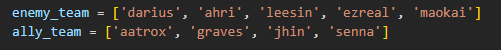
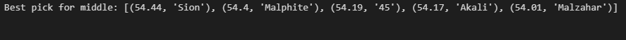
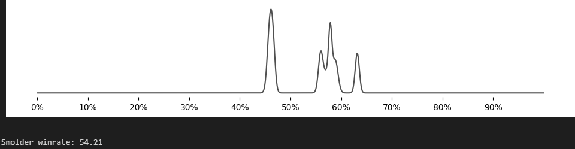

# LoL Moneyball

This script helps guide your team's drafting in champion select. Everyone knows the winrates of a champion against your laner, and it's easy to forget about the synergies of your teammates and counterspicks from other laners when considering your pick. We calculate the winrates given the champion picks of the team and enemy to find the empirically best champion pick.


## About the numbers

This calculates the absolute best picks given the current champion picks. This assumes an average performance from each player, which means we don't get data from their past games. You wouldn't be able to in ranked games anyways because names are hidden. The winrate data is from Emerald and above. The winrates are only considered if they exist with 0.3% of the champion's games. Lastly, the champion data is only taken from their most played role, so off-meta picks are treated as if they're playing within their main role.


## Installation

This script uses python with these libraries:

**BeautifulSoup4** is a Python library for parsing HTML and XML documents, widely used for web scraping to extract data from web pages. We use this to parse data from Selenium


**Selenium** is a tool for automating web browsers, enabling the testing of web applications and automation of web tasks. We use this in conjunction with BeautifulSoup4 to scrape data from lolalytics

**Matplotlib** is a plotting library for creating static, animated, and interactive visualizations. We use this to create a graph of the winrates for each champino matchup

**SciPy** is a Python library for scientific and technical computing, offering modules for optimization, linear algebra, integration. We use this to calculate the Probability Density Function for the graph


Install these libraries by entering this in command prompt:

```bash
pip install beautifulsoup4 selenium matplotlib scipy
```
    

## Sample Images

In *winrate.ipynb* 

Put champion picks here



Best champ picks for midlane



Winrate graph

